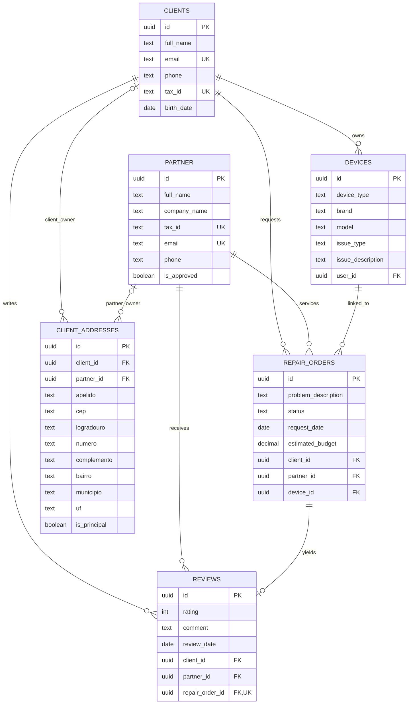

# DER implementado — SmartFix

O banco usa o DER fornecido com duas adaptações confirmadas: os endereços permanecem
exclusivamente em `client_addresses`, e a autenticação continua sendo a do SmartFix.

## Relações e campos principais



Os nomes físicos são minúsculos: `clients`, `partner`, `devices`,
`repair_orders`, `reviews` e `client_addresses`.

- **Autenticação:** `clients.id` e `partner.id` identificam as próprias contas.
  Não foram criados campos `user_id` nessas duas tabelas apontando para uma
  identidade externa inexistente. Os hashes de senha e as sessões atuais permanecem válidos.
- **Aparelhos:** `devices.user_id` referencia `clients.id`. É o cliente proprietário,
  nunca um UUID recebido livremente do formulário: a API usa a sessão autenticada.
- **Endereços:** exatamente um entre `client_id` e `partner_id` deve ser preenchido.
  Não há coluna `address` em `clients` ou `partner`.
- **Ordens:** uma FK composta `(device_id, client_id)` exige que o aparelho pertença
  ao cliente. Contas e aparelhos ligados a ordens não podem ser excluídos sem resolver
  essas referências.
- **Avaliações:** nota de 1 a 5; no máximo uma por ordem. Uma FK composta exige
  que cliente e parceiro coincidam com os da ordem. Um trigger permite cadastrar
  a avaliação somente quando a ordem estiver concluída.
- **Orçamento:** `estimated_budget` é `numeric(12,2)`, em reais, calculado a partir
  dos itens em centavos; antes de um orçamento, seu valor é nulo.
- **Datas:** `request_date` e `review_date` são datas. `created_at` mantém também
  horário e fuso para ordenar e exibir os registros existentes.

## Campos complementares preservados

O DER apresenta os campos de negócio centrais. O aplicativo também usa hashes
de senha, timestamps, aprovação de parceiros e avatar. Em `devices` permanecem
`photo_url`, `nickname` e `serial_number`. Na ordem permanecem o nome do aparelho
na ocasião (`device_label`), diagnóstico e os arrays JSONB `symptoms`, `checklist`,
`quote` e `history`. Esses campos evitam perda de recursos e dados da versão anterior.

Os campos `issue_type` e `issue_description` são opcionais na API de aparelhos,
expostos como `issueType` e `issueDescription`; cada reparo conserva sua própria
descrição em `repair_orders.problem_description`.

## Tabelas auxiliares

`workflow_records` mantém apenas `notification`, `service`, `reset` e `google`.
Ordens e avaliações são persistidas exclusivamente nas novas tabelas; o adaptador
do servidor conserva o contrato da API sem duplicá-las no JSONB auxiliar.

`smartfix_migrations` registra as migrations aplicadas. O migrador salva uma
cópia local dos dados em `.smartfix-data/backups/` antes de mudar o esquema e
confirma cada migration junto com seu registro de versão, na mesma transação.

## Migração e segurança

A migration `20260918_der.sql` renomeia colunas e a tabela de aparelhos sem
recriar contas nem alterar UUIDs. Converte ordens e avaliações antigas de
`workflow_records`, conservando triagem, itens de orçamento e histórico.
A data exata das avaliações antigas não existia no documento legado; para esses
casos usa a data da última mudança de status, ou da solicitação se não houver histórico.
Qualquer vínculo inválido aborta a migração inteira.

RLS fica ativado em todas as tabelas da aplicação e na tabela de migrations.
Os papéis `anon` e `authenticated` não têm acesso direto; as APIs Next.js validam
a sessão e o proprietário. A conexão PostgreSQL fica somente no servidor.

Execute em `smartfix-app/`:

```powershell
npm run db:migrate
npm run db:check
npm run db:smoke
```
