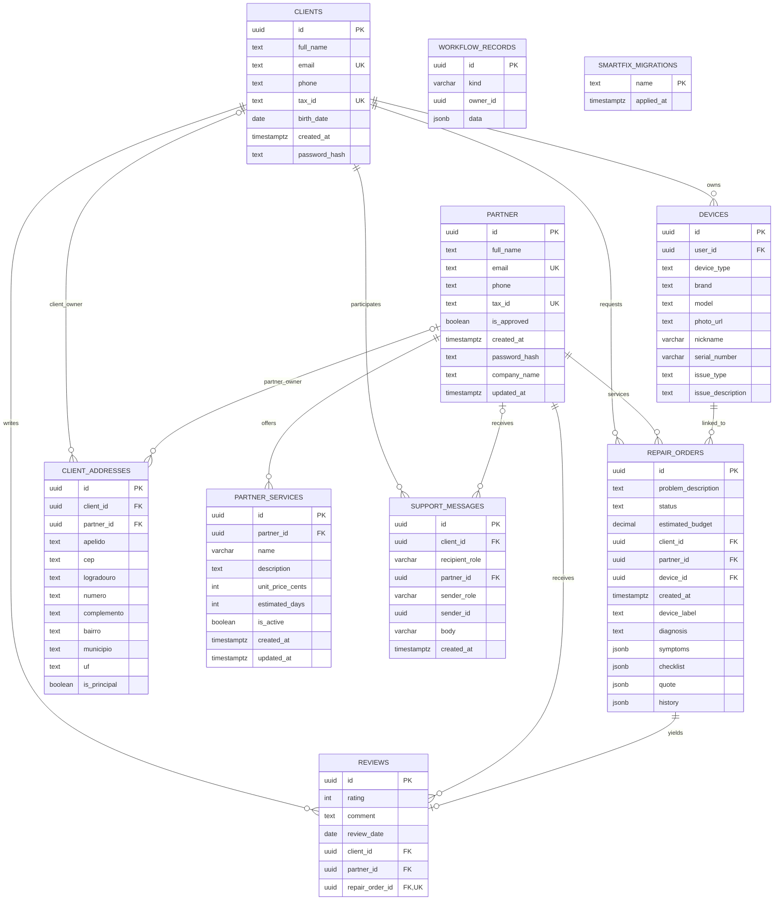

# DER SmartFix — visão geral

Este documento apresenta a estrutura completa do banco relacional do SmartFix,
executado em PostgreSQL/Supabase e consumido pela aplicação Next.js.

## Relações e campos principais

```mermaid
erDiagram
    CLIENTS ||--o{ DEVICES : owns
    CLIENTS ||--o{ REPAIR_ORDERS : requests
    PARTNER ||--o{ REPAIR_ORDERS : services
    DEVICES ||--o{ REPAIR_ORDERS : linked_to
    CLIENTS ||--o{ REVIEWS : writes
    PARTNER ||--o{ REVIEWS : receives
    REPAIR_ORDERS ||--o| REVIEWS : yields
    CLIENTS o|--o{ CLIENT_ADDRESSES : client_owner
    PARTNER o|--o{ CLIENT_ADDRESSES : partner_owner
    PARTNER ||--o{ PARTNER_SERVICES : offers
    CLIENTS ||--o{ SUPPORT_MESSAGES : participates
    PARTNER o|--o{ SUPPORT_MESSAGES : receives

    CLIENTS {
        uuid id PK
        text full_name
        text email UK
        text phone
        text tax_id UK
        date birth_date
        timestamptz created_at
        text password_hash
    }
    PARTNER {
        uuid id PK
        text full_name
        text email UK
        text phone
        text tax_id UK
        boolean is_approved
        timestamptz created_at
        text password_hash
        text company_name
        timestamptz updated_at
    }
    DEVICES {
        uuid id PK
        uuid user_id FK
        text device_type
        text brand
        text model
        text photo_url
        varchar nickname
        varchar serial_number
        text issue_type
        text issue_description
    }
    REPAIR_ORDERS {
        uuid id PK
        text problem_description
        text status
        decimal estimated_budget
        uuid client_id FK
        uuid partner_id FK
        uuid device_id FK
        timestamptz created_at
        text device_label
        text diagnosis
        jsonb symptoms
        jsonb checklist
        jsonb quote
        jsonb history
    }
    REVIEWS {
        uuid id PK
        int rating
        text comment
        date review_date
        uuid client_id FK
        uuid partner_id FK
        uuid repair_order_id FK,UK
    }
    CLIENT_ADDRESSES {
        uuid id PK
        uuid client_id FK
        uuid partner_id FK
        text apelido
        text cep
        text logradouro
        text numero
        text complemento
        text bairro
        text municipio
        text uf
        boolean is_principal
    }
    PARTNER_SERVICES {
        uuid id PK
        uuid partner_id FK
        varchar name
        text description
        int unit_price_cents
        int estimated_days
        boolean is_active
        timestamptz created_at
        timestamptz updated_at
    }
    WORKFLOW_RECORDS {
        uuid id PK
        varchar kind
        uuid owner_id
        jsonb data
    }
    SUPPORT_MESSAGES {
        uuid id PK
        uuid client_id FK
        varchar recipient_role
        uuid partner_id FK
        varchar sender_role
        uuid sender_id
        varchar body
        timestamptz created_at
    }
    SMARTFIX_MIGRATIONS {
        text name PK
        timestamptz applied_at
    }
```

Os nomes físicos são minúsculos: `clients`, `partner`, `devices`,
`repair_orders`, `reviews`, `client_addresses`, `partner_services`,
`workflow_records`, `support_messages` e `smartfix_migrations`.

- **Autenticação:** `clients.id` e `partner.id` identificam as próprias contas.
  Não foram criados campos `user_id` nessas duas tabelas apontando para uma
  identidade externa inexistente. Os hashes de senha e as sessões atuais permanecem válidos.
- **Aparelhos:** `devices.user_id` referencia `clients.id`. É o cliente proprietário,
  nunca um UUID recebido livremente do formulário: a API usa a sessão autenticada.
- **Endereços:** exatamente um entre `client_id` e `partner_id` deve ser preenchido.
  Não há coluna `address` em `clients` ou `partner`.
- **Ordens:** uma FK composta `(device_id, client_id)` exige que o aparelho pertença
  ao cliente. Contas e aparelhos ligados a ordens não podem ser excluídos sem resolver
  essas referências.
- **Avaliações:** nota de 1 a 5; no máximo uma por ordem. Uma FK composta exige
  que cliente e parceiro coincidam com os da ordem. Um trigger permite cadastrar
  a avaliação somente quando a ordem estiver concluída.
- **Orçamento:** `estimated_budget` é `numeric(12,2)`, em reais, calculado a partir
  dos itens em centavos; antes de um orçamento, seu valor é nulo.
- **Datas:** `review_date` é uma data. Em ordens, `created_at` é a fonte canônica
  e mantém data, horário e fuso para ordenar e exibir os registros.

## Resumo da modelagem

O aplicativo usa hashes de senha, timestamps e aprovação de parceiros. Os aparelhos
armazenam foto, apelido, número de série e informações iniciais do defeito. Cada ordem
mantém o nome do aparelho na ocasião (`device_label`), diagnóstico, sintomas,
checklist, orçamento detalhado e histórico de status.

Os campos `issue_type` e `issue_description` são opcionais na API de aparelhos,
expostos como `issueType` e `issueDescription`; cada reparo conserva sua própria
descrição em `repair_orders.problem_description`.

## Tabelas auxiliares

`workflow_records` mantém apenas `notification`, `service`, `reset` e `google`.
Ordens e avaliações são persistidas exclusivamente nas novas tabelas; o adaptador
do servidor conserva o contrato da API sem duplicá-las no JSONB auxiliar.

`partner_services` guarda o catálogo e o preço em centavos de cada assistência.
`support_messages` registra as conversas do cliente com a SmartFix ou com uma
assistência. `sender_id` identifica o autor para auditoria; `recipient_role` e
`partner_id` determinam o destino da conversa.

`smartfix_migrations` registra as migrations aplicadas. O migrador salva uma
cópia local dos dados em `.smartfix-data/backups/` antes de mudar o esquema e
confirma cada migration junto com seu registro de versão, na mesma transação.

## Segurança

RLS fica ativado em todas as tabelas da aplicação e na tabela de migrations.
Os papéis `anon` e `authenticated` não têm acesso direto; as APIs Next.js validam
a sessão e o proprietário. A conexão PostgreSQL fica somente no servidor.
