# SmartFix - Parte 4: modelagem atualizada do sistema

**Data:** 3 de outubro de 2026  
**Objetivo:** representar a versão implementada do SmartFix por meio de modelos comportamentais, estruturais, arquiteturais e de dados.  
**Formato-fonte:** Mermaid editável, destinado à revisão e posterior exportação em alta resolução para a monografia.

## 1. Premissas da modelagem

Os diagramas desta parte seguem as conclusões das Partes 1, 2 e 3:

- o SmartFix é uma plataforma web responsiva;
- os atores operacionais atuais são cliente, assistência técnica parceira e administrador;
- entregador não é ator da versão atual;
- pagamento e logística não fazem parte do fluxo implementado;
- o navegador acessa as APIs Next.js, nunca diretamente o PostgreSQL;
- a autenticação principal utiliza credenciais próprias, hash bcrypt e sessão assinada;
- Google OAuth e envio de e-mail são integrações opcionais;
- somente assistências aprovadas aparecem na descoberta;
- toda ordem vincula cliente, dispositivo do cliente e parceiro;
- as transições da ordem obedecem à política implementada.

## 2. Auditoria dos diagramas anteriores

| Diagrama anterior | Problema encontrado | Tratamento |
| --- | --- | --- |
| Casos de uso | Inclui entregador, pagamento, gestão completa de usuários e relatórios. | Substituído pelos atores e casos confirmados. |
| Atividades | Inclui motoboy, entrega, garantia e aceite do pedido pelo parceiro. | Substituído pelo fluxo real de solicitação, orçamento e reparo. |
| Sequência | Inclui coleta, pagamento e entrega; não representa APIs nem autorização. | Dividido em sequências menores e rastreáveis. |
| Estados | Condiciona reparo ao pagamento e utiliza estados inexistentes. | Substituído pelos oito estados reais. |
| Classes | Contém herança de usuário e entidade Pagamento inexistentes. | Substituído por modelo de domínio aderente aos modelos atuais. |
| Componentes | Afirma PWA, Supabase Auth, Realtime e gateway de pagamento. | Substituído pela arquitetura Next.js e PostgreSQL do servidor. |
| Implantação | Afirma PWA, WebSocket e bucket de mídia. | Substituído pelo cenário comprovado e pelas integrações opcionais. |
| DER | A versão recente está majoritariamente alinhada ao banco. | Consolidado e complementado com cardinalidades e tabelas auxiliares. |

## 3. Diagrama de casos de uso

### 3.1 Finalidade

Apresentar as capacidades disponíveis para cada ator. Como Mermaid não possui suporte nativo completo a UML de casos de uso, o modelo utiliza um fluxograma de associações, preservando a distinção entre atores e funcionalidades.

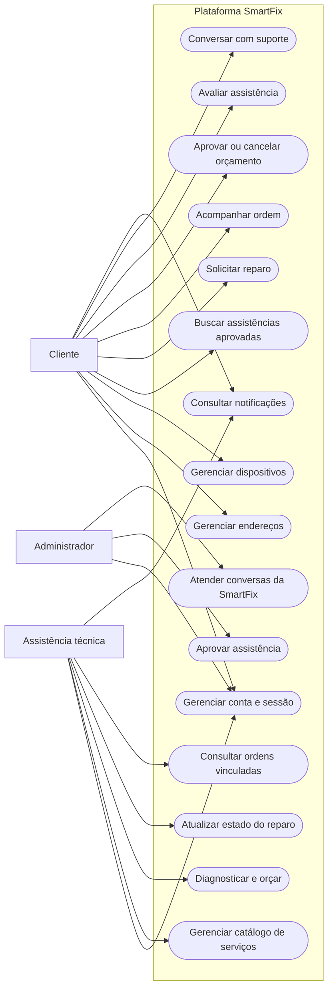

### 3.2 Interpretação

O cliente concentra as operações de preparação e acompanhamento do reparo. O parceiro administra sua oferta e executa as etapas técnicas. O administrador atual possui escopo restrito ao credenciamento de assistências e às APIs de atendimento direcionadas à SmartFix. Gestão geral de usuários, relatórios, pagamentos e logística não aparecem porque não integram a versão atual.

## 4. Diagrama de atividades do fluxo principal

### 4.1 Finalidade

Representar o caminho da solicitação até a conclusão, incluindo cancelamento e espera de peças.

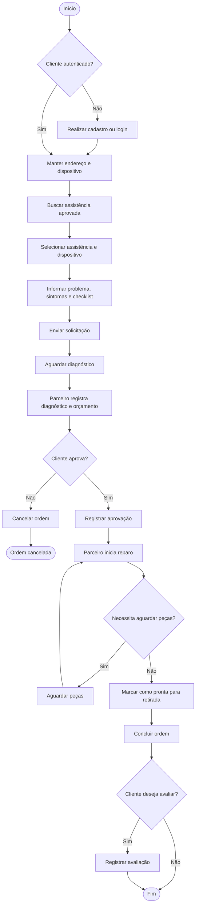

### 4.2 Responsabilidades

- cliente: autenticar-se, preparar dados, escolher assistência, solicitar, decidir sobre orçamento e avaliar;
- parceiro: diagnosticar, orçar e atualizar as etapas técnicas;
- sistema: validar autorização, persistir mudanças, manter histórico e disponibilizar notificações.

Não há aceite prévio da solicitação pelo parceiro. A primeira ação técnica prevista é registrar diagnóstico e orçamento.

## 5. Diagramas de sequência

Os fluxos foram separados para evitar um único diagrama excessivamente longo.

### 5.1 Cadastro e autenticação por senha

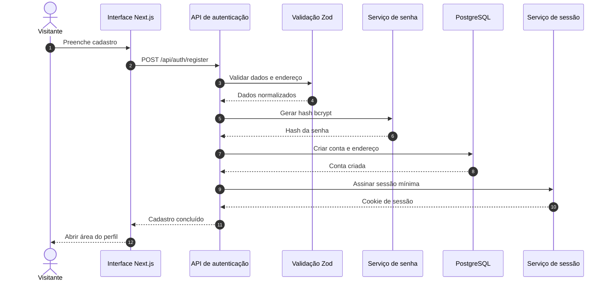

**Variações:** dados inválidos encerram o fluxo antes da persistência; documento ou e-mail duplicado produz resposta controlada; parceiro recém-cadastrado permanece sem aprovação administrativa.

### 5.2 Descoberta geográfica de assistências

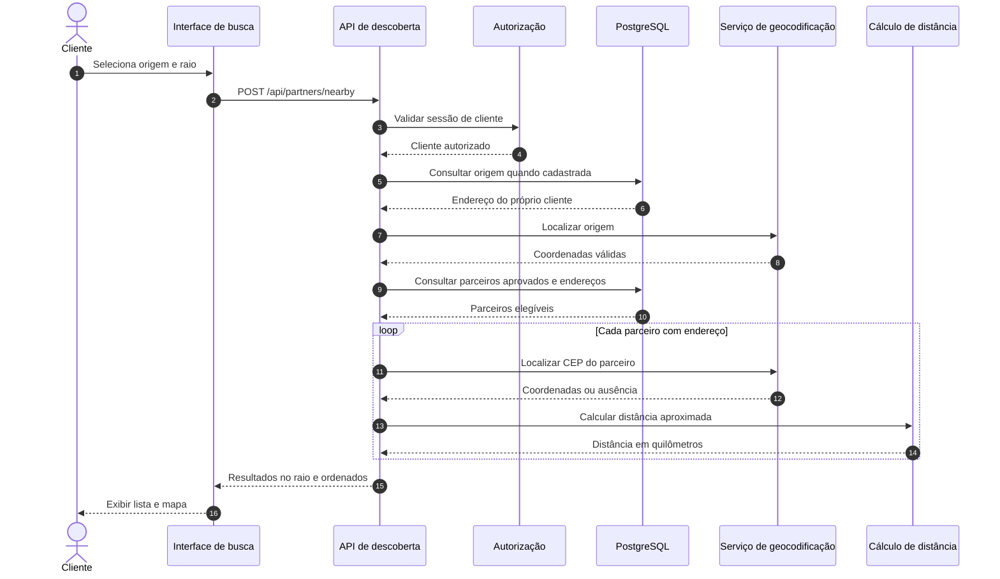

**Regra de precisão:** o cálculo representa distância geográfica aproximada, não rota de deslocamento. Localizações ausentes não são inventadas.

### 5.3 Solicitação, diagnóstico e decisão do orçamento

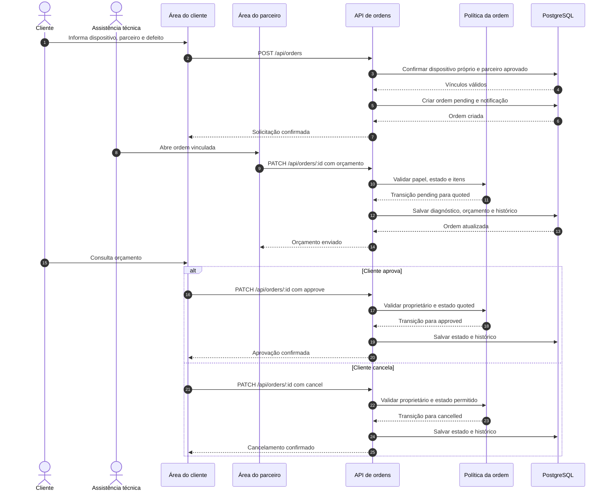

### 5.4 Atualização técnica e avaliação

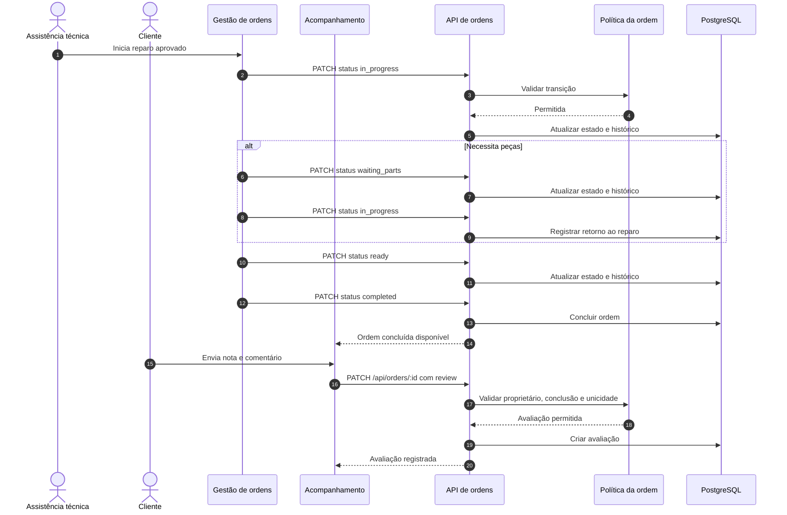

## 6. Diagrama de estados da ordem de serviço

### 6.1 Estados canônicos

| Estado técnico | Rótulo exibido |
| --- | --- |
| `pending` | Aguardando diagnóstico |
| `quoted` | Aguardando aprovação |
| `approved` | Orçamento aprovado |
| `in_progress` | Em reparo |
| `waiting_parts` | Aguardando peças |
| `ready` | Pronto para retirada |
| `completed` | Concluído |
| `cancelled` | Cancelado |

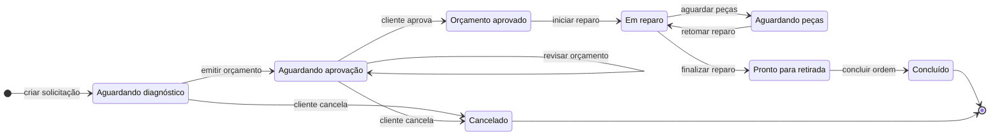

Não existe transição de `approved` diretamente para `completed`. O sistema também não condiciona `in_progress` à confirmação de pagamento.

## 7. Modelo de domínio

### 7.1 Finalidade

Mostrar as entidades centrais e seus relacionamentos conceituais. Este modelo não pretende reproduzir todas as classes internas de controller e service.

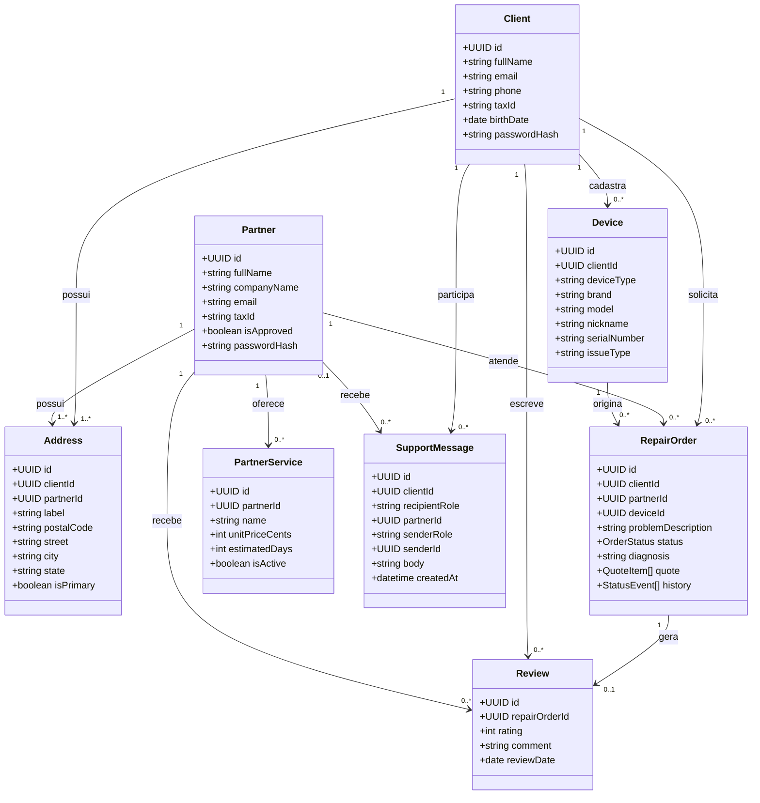

### 7.2 Observações

- `Address` possui um único proprietário lógico: cliente ou parceiro;
- `Review` depende de ordem concluída e é única por ordem;
- `SupportMessage` pode ter a SmartFix como destinatária sem um parceiro associado;
- orçamento e histórico são objetos estruturados armazenados com a ordem;
- notificações, recuperação e identidade Google utilizam registros auxiliares de workflow.

## 8. Diagrama de componentes

### 8.1 Finalidade

Representar as responsabilidades internas sem sugerir microserviços inexistentes. A aplicação é um único projeto Next.js organizado em camadas.

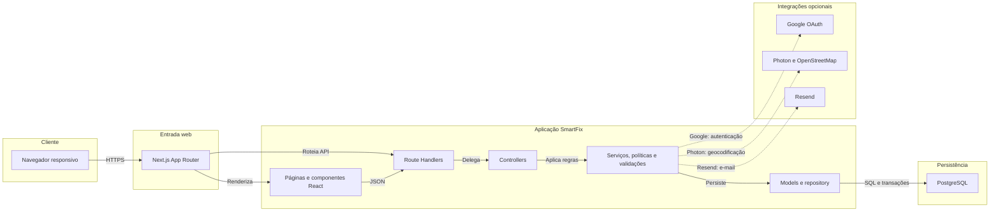

### 8.2 Responsabilidades das camadas

| Camada | Responsabilidade |
| --- | --- |
| Páginas e componentes | Interface, formulários, navegação e apresentação. |
| Route Handlers | Endpoints HTTP do App Router. |
| Controllers | Orquestração das requisições e respostas. |
| Serviços e políticas | Autenticação, autorização, regras de ordem, dashboards e integrações. |
| Validações | Normalização e rejeição de entradas inválidas. |
| Models e repository | Mapeamento Sequelize e persistência. |
| PostgreSQL | Integridade relacional, dados operacionais, migrations e RLS. |

## 9. Diagrama de implantação

### 9.1 Cenário de execução

O repositório suporta execução local e implantação em provedor compatível com Next.js. Vercel e Supabase podem compor o ambiente, mas o diagrama diferencia dependências obrigatórias de serviços opcionais.

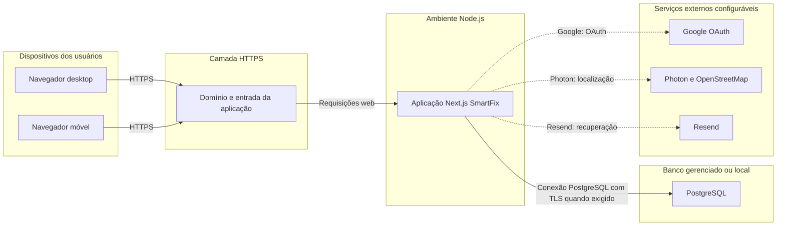

### 9.2 Limites do diagrama

- não afirma que a implantação de produção já está ativa;
- não inclui bucket de mídia porque não há fluxo completo de upload confirmado;
- não utiliza WebSocket porque os fluxos atuais não dependem dele;
- não utiliza acesso direto do navegador ao Supabase;
- não apresenta CDN, observabilidade ou backup sem configuração comprovada.

## 10. Modelo entidade-relacionamento

### 10.1 DER consolidado

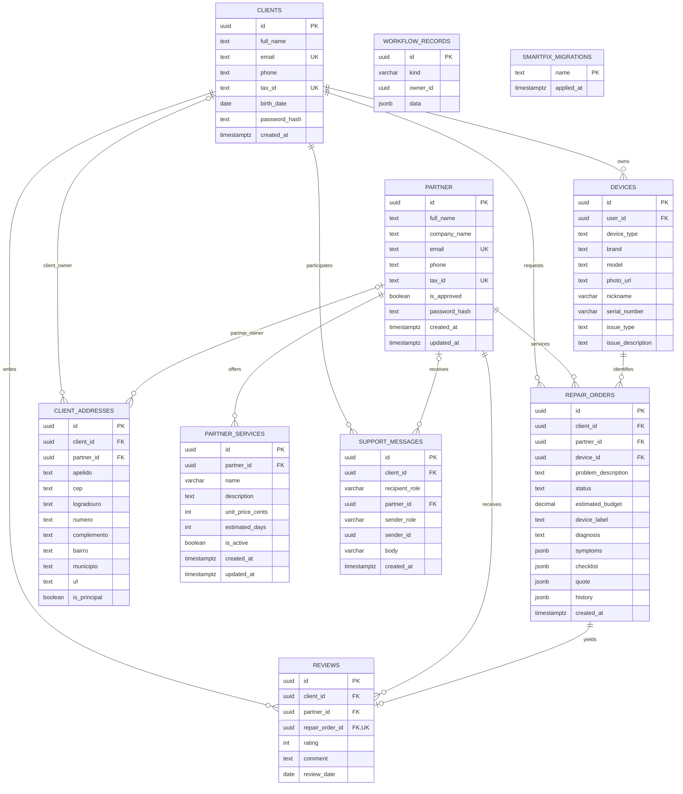

### 10.2 Restrições relevantes do DER

1. `CLIENT_ADDRESSES` exige exatamente um proprietário entre cliente e parceiro.
2. `DEVICES.user_id` referencia o cliente proprietário.
3. A chave estrangeira composta da ordem impede vincular dispositivo de outro cliente.
4. Cliente, parceiro e dispositivo referenciados por ordem utilizam exclusão restrita.
5. `REVIEWS.repair_order_id` é único.
6. A avaliação deve repetir o mesmo cliente e parceiro da ordem.
7. A nota fica entre 1 e 5.
8. O estado da ordem pertence ao conjunto de estados permitido.
9. Sintomas, checklist, orçamento e histórico devem ser arrays JSON.
10. Serviço do parceiro possui limites para preço e prazo.
11. Mensagem de suporte exige destino coerente e corpo não vazio.
12. RLS permanece habilitada nas tabelas da aplicação.

### 10.3 Tabelas sem relacionamento relacional explícito no DER

`WORKFLOW_RECORDS` utiliza `owner_id` e JSON estruturado para notificações, recuperação de senha, identidade Google e registros auxiliares. `SMARTFIX_MIGRATIONS` registra versões aplicadas. Essas relações são controladas pela aplicação e, por isso, as tabelas aparecem sem arestas de chave estrangeira no diagrama.

## 11. Matriz entre diagramas e requisitos

| Diagrama | Requisitos representados |
| --- | --- |
| Casos de uso | RF-01 a RF-47 em visão por ator. |
| Atividades | RF-03, RF-14 a RF-17, RF-19 a RF-34. |
| Sequência de cadastro | RF-01 a RF-05, RN-01 a RN-06. |
| Sequência de descoberta | RF-19 a RF-23, RN-15 a RN-19. |
| Sequência de orçamento | RF-24 a RF-31, RN-20 a RN-26. |
| Sequência técnica e avaliação | RF-32 a RF-34, RN-27 a RN-36. |
| Estados da ordem | RF-29 a RF-33, RN-21 a RN-33. |
| Modelo de domínio | RF-09 a RF-47 e regras de propriedade. |
| Componentes | RNF-03 a RNF-11 e RNF-14. |
| Implantação | RNF-05, RNF-06, RNF-10 e integrações condicionais. |
| DER | RNF-06 a RNF-08, RNF-13 e restrições de persistência. |

## 12. Figuras recomendadas para a monografia

Nem todos os diagramas precisam ter o mesmo tamanho ou ocupar página inteira. A seleção recomendada é:

| Figura | Uso sugerido |
| --- | --- |
| Casos de uso | Capítulo 4, após apresentar os atores. |
| Atividades | Capítulo 4, ao explicar o fluxo principal. |
| Sequência de cadastro | Capítulo 6, autenticação. |
| Sequência de descoberta | Capítulo 6, localização. |
| Sequência de orçamento | Capítulo 6, fluxo da ordem. |
| Sequência técnica e avaliação | Capítulo 6, acompanhamento. |
| Estados | Capítulo 4 ou 5, regras da ordem. |
| Modelo de domínio | Capítulo 5, visão conceitual. |
| Componentes | Capítulo 5, arquitetura lógica. |
| Implantação | Capítulo 5, arquitetura física. |
| DER | Capítulo 5, persistência. |

## 13. Orientações para exportação

Antes de inserir as figuras no documento final:

1. revisar textos e nomes com os autores;
2. renderizar cada Mermaid em formato vetorial, preferencialmente SVG;
3. usar fundo claro e tipografia legível;
4. evitar redução que torne rótulos ilegíveis;
5. numerar como figura no documento, não dentro da imagem;
6. incluir título acima ou abaixo conforme o padrão institucional adotado;
7. indicar `Fonte: Elaborado pelos autores (2026)`;
8. citar e interpretar cada figura no texto;
9. conferir a legibilidade na página A4 e no PDF final.

## 14. Resultado da Parte 4

A modelagem atualizada remove recursos inexistentes e passa a representar:

- três atores operacionais reais;
- fluxo completo de solicitação, orçamento, reparo e avaliação;
- oito estados canônicos da ordem;
- arquitetura em camadas do projeto Next.js;
- integrações externas opcionais;
- domínio e persistência PostgreSQL atuais;
- rastreabilidade com os requisitos da Parte 3.

O próximo passo é a Parte 5: preparar o plano e o inventário das capturas de tela, definir dados demonstrativos seguros e organizar a narrativa visual das interfaces do cliente, parceiro e administrador.
