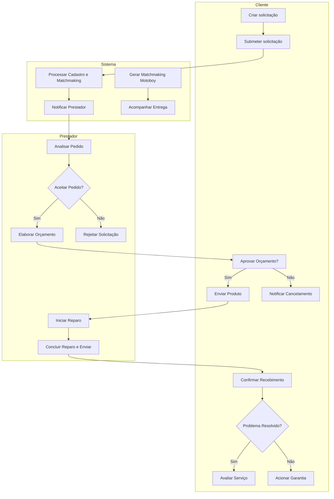

Diagrama de Atividades

### Descrição
Ilustra o fluxo do processo de ponta a ponta nas raias de cada papel (Motoboy, Cliente, Sistema e Prestador). Modela as regras de decisão para aceite de orçamento, triagem, envio de notificações e as entregas intermediárias até a confirmação do cliente e encerramento.

