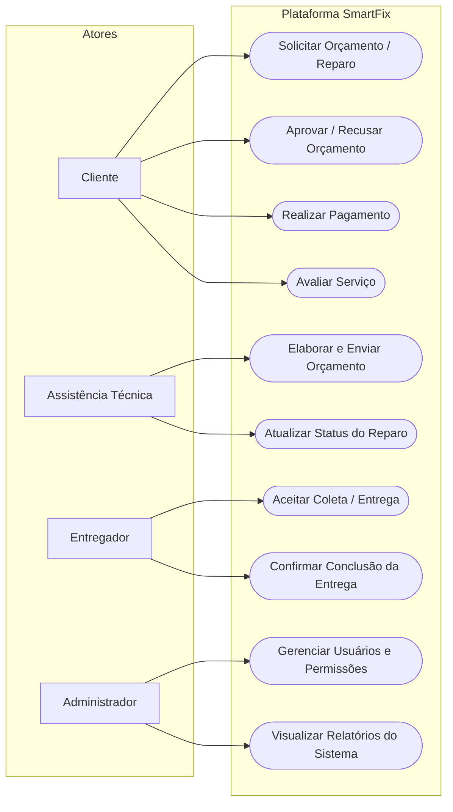

Diagrama de Casos de Uso

### Descrição
Descreve as principais funcionalidades do sistema SmartFix a partir da perspectiva dos atores que interagem com a plataforma (`Cliente`, `Assistência Técnica`, `Entregador` e `Administrador`). Mapeia os casos de uso operacionais, como abertura de chamados, envio e aprovação de orçamentos, gestão de entregas e administração de contas.

