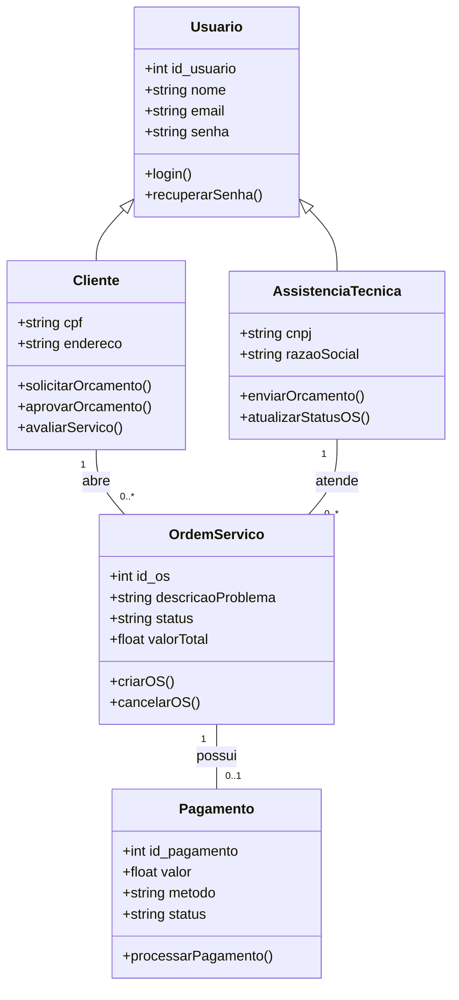

Diagrama de Classes

### Descrição
Mapeia a estrutura estática das classes do sistema, definindo os atributos, métodos e heranças do domínio. Demonstra como os atores do sistema especializam a classe base `Usuario` e como interagem com os módulos operacionais de `OrdemServico` e `Pagamento`.

