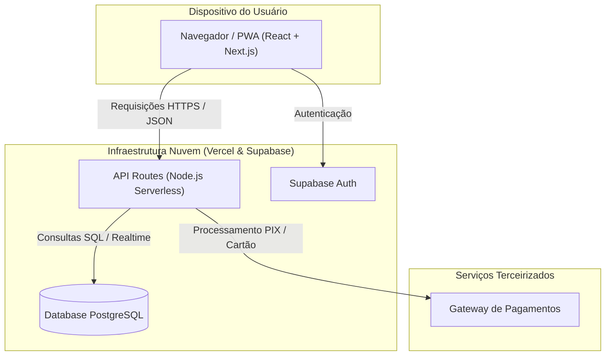

Diagrama de Componentes (Arquitetura)

### Descrição
Modela a estrutura de software da aplicação, detalhando os módulos independentes (PWA Front-end, API Serverless no Next.js, Autenticação/Banco no Supabase) e como eles se integram via serviços de borda e conexões bancárias via gateways.

