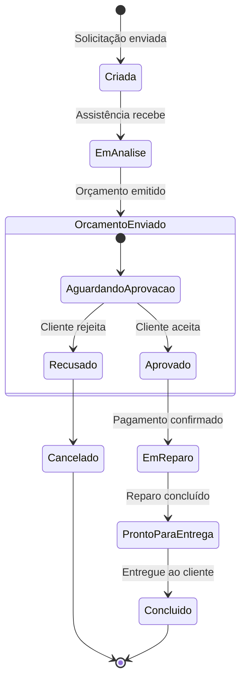

Diagrama de Gráfico de Estados (Ciclo da OS)

### Descrição
Descreve os estados possíveis de uma Ordem de Serviço (OS) ao longo do seu ciclo de vida dentro da plataforma SmartFix, destacando as transições gatilhadas pelas ações do cliente, do parceiro ou por eventos de pagamento.

