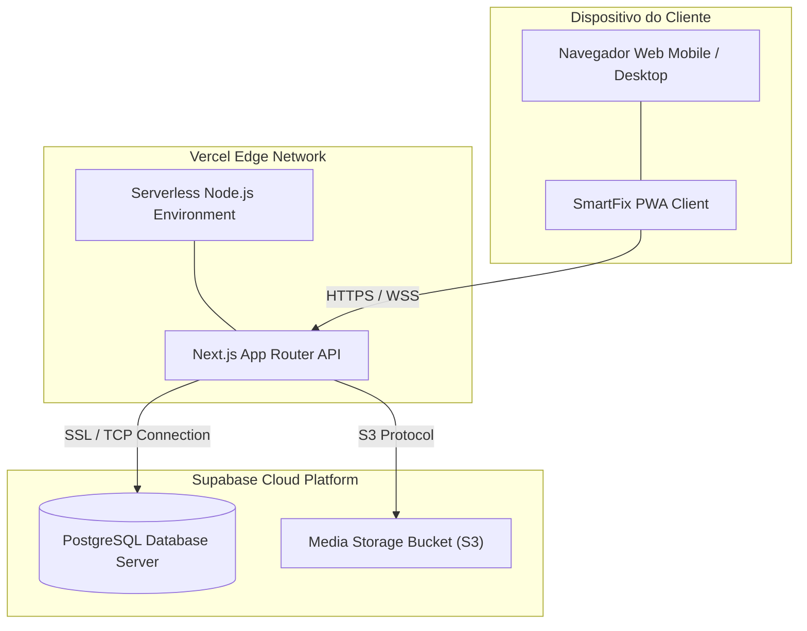

Diagrama de Implantação (Deployment)

### Descrição
Representa os nós de hardware e a infraestrutura física/cloud em que a solução SmartFix é executada em produção, destacando o ambiente Serverless da Vercel para a camada web e o cluster do Supabase para persistência de dados.

