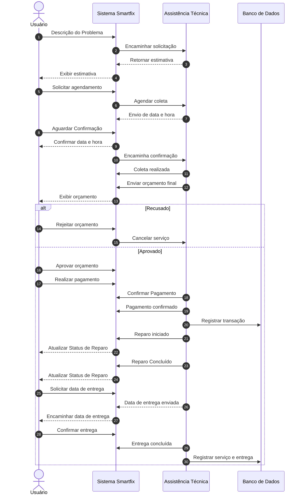

Diagrama de Sequência

### Descrição
Demonstra a troca cronológica de mensagens entre os atores (Cliente, Assistência Técnica) e os componentes do sistema (Front-end/PWA, API Serverless e Banco de Dados) ao longo do tempo. Cobre desde a solicitação inicial do reparo até a aprovação/recusa de orçamento, checkout financeiro e entrega do dispositivo.

